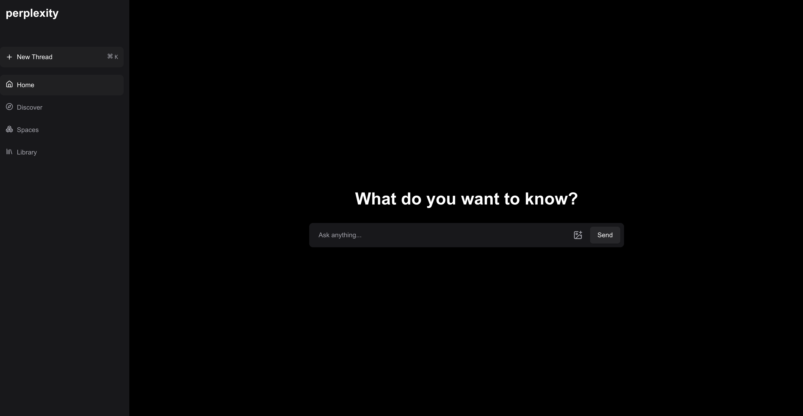

# Perplexity Clone

A simplified clone of Perplexity.ai built as part of the Hanover Takehome Interview Question. This application allows users to submit queries and receive AI-generated responses based on search results, complete with citations.

## Screenshots


_Main interface where users can submit their queries_


_Example of search results with AI-generated response_

## Project Overview

This project implements a basic version of Perplexity.ai's functionality, where users can:

- Submit queries through a clean interface
- Receive search results from the web
- Get AI-generated responses based on the search results
- View citations for the information provided

## Tech Stack

- **Frontend**: TypeScript + [Framework]
- **Backend**: Node.js with TypeScript
- **Search API**: [Search Provider]
- **AI Model**: [AI Provider]

## Getting Started

### Prerequisites

- Node.js (v16 or higher)
- npm or yarn
- API keys for the search and AI providers

### Installation

1. Clone the repository:

   ```bash
   git clone https://github.com/[username]/perplexity-clone.git
   cd perplexity-clone
   ```

2. Install frontend dependencies:

   ```bash
   cd client
   npm install
   ```

3. Install backend dependencies:

   ```bash
   cd ../server
   npm install
   ```

### Running the Application

1. Start the backend server:

   ```bash
   cd server
   npm run dev
   ```

2. Start the frontend server (in a new terminal window):

   ```bash
   cd client
   npm run dev
   ```

### Project Structure

```
perplexity-clone/
├── client/        # Frontend application
├── server/        # Backend server
├── docs/          # Documentation assets
│   └── images/    # Screenshot images
├── README.md      # This file
└── .gitignore     # Git ignore file
```

## Contributing

Contributions are welcome! If you'd like to improve the project, feel free to fork the repository and submit a pull request.

## License

This project is licensed under the MIT License. See the `LICENSE` file for details.

## Contact

For any inquiries, please contact [your email or GitHub profile].
